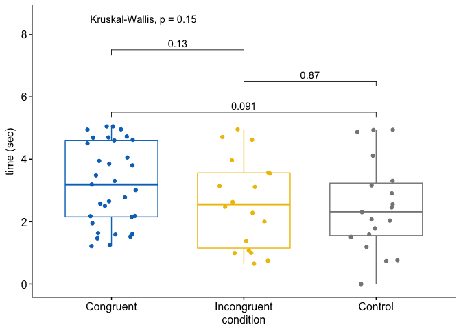

Data Visualization Experiments
================
Muxuan Lyu & Shuai Shao
May 4, 2018

Introduction
============

Vision is the most important sense for human beings. Above **70%** of environmental information are accepted by our eyes (Dale Purves, 2008). Data visualization is a complicated process that involves multiple elements, among which the color plays an important role. Color conveys a lot of meaningful information unconsciously. Our brains are always trying to establish the relationship between the color and specific meaning. According to [Lin et al. (2013)](http://eds.b.ebscohost.com.proxy.uchicago.edu/eds/pdfviewer/pdfviewer?vid=2&sid=6f030dac-b3d6-4b66-b6a2-2aba19836a59%40sessionmgr101), the “associations of colors and meanings” may be grounded in the physical appearance of objects, common metaphors, or other linguistic or cultural conventions. For instance, when visualizing the world map, we always use blue to represent oceans and use green to represent lands. Since it is obvious that human beings have the color bias that relates specific colors and specific meanings, computer programmer set a series of "default value" for data visualization.

In this project, we plan to conduct an in-depth study to understand whether the color bias exists and how it affects our graphic perception. We will test four specific aspect that prevails in our daily life, the gender-color bias, the emotion-color bias, the political color bias, and the gradient bias. This study will deepen our understanding of color selection, perception, and interpretation in data visualization.

Method
======

Participants
------------

Participants are recruited on [Amazon Mechanical Turk (MTurk)](https://www.mturk.com/) and they are invited to complete a questionnaire on Qualtrics. As described on the website, "the MTurk web service enables companies to programmatically access this marketplace and a diverse, on-demand workforce and developers can leverage this service to build human intelligence directly into their applications." Participants are required to agree on the consent form at the beginning, and those who complete the survey will receive $0.05 as rewards.

Procedure
---------

The order of four studies is randomized among each participant to avoid the order effect. The participants are randomly assigned to one of the congruent condition, incongruent condition, and the control condition within the study. In each study, participants are required to complete two multiple choices according to the graphic. Totally, they have to finish eight questions. Each question lasts five seconds and between two questions there is a two-second break.

Materials
---------

The questionnaire consists of four studies.

### Study 1

In Study 1, we aim to test the gender bias. Specifically, we aim to test whether information-receivers have the bias that pink stands for females while blue stands for males.

In the congruent condition, the graphic displayed is congruent with our hypothetical bias that blue represents males and pink represents females. In the incongruent condition, the graphic displayed is incongruent with our hypothetical bias, and therefore in this condition, blue represents females and pink represents males. In the control condition, we use two colors unrelated to our hypothetical bias to represent the males and females.

### Study 2

It is widely acknowledged that color is a strong indicator of the emotion [(Kaya & Epps, 200)](http://eds.b.ebscohost.com.proxy.uchicago.edu/eds/pdfviewer/pdfviewer?vid=2&sid=6f030dac-b3d6-4b66-b6a2-2aba19836a59%40sessionmgr101). Each color may have several associations with different emotions, but we tend to prefer a specific color in the specific mood. In this study, we will test the color-emotion associations. The hypothetical associations are red-angry, dark green-disgust, dark grey-fear, orange-joy, blue-sadness, and purple-surprise [(Manav, 2007)](https://doi.org/10.1002/col.20294).

### Study 3

In Study 3, we aim to test the political color bias. In the United States, According to [Smithonia Magazine](https://www.smithsonianmag.com/history/when-republicans-were-blue-and-democrats-were-red-104176297/#ixzz2BSTncTH4) and [the Verge](https://www.theverge.com/2012/11/6/3609534/republicans-red-democrats-blue-why-election), it was not until 2000 that red denote the Republican and blue denote the Democrats. It is especially interesting since unlike the emotion color bias which might have some evolutionary meaning, the political color bias is a theoretical "novel bias" spread by social media. This study will tell us whether the political color has been a common bias in human cognition (especially for Americans) and how it affects data visualization. In the congruent condition, the graphic displayed is congruent with our hypothetical bias that blue represents the Democrat party and red represents the Republican party. In the incongruent condition, the matching is opposite, in which blue represents Democrats and pink represents Republicans. In the control condition, we use two colors unrelated to our hypothetical bias.

### Study 4

Gradient graphs are commonly used in geography and [astronomy](https://scitechdaily.com/new-video-maps-the-motions-of-structures-of-the-nearby-universe/). The gradient is typically applied to continuous variables and it denotes the degree or level. However, it remains unclear whether the direction of the color gradient could potentially affect our graph reading. In this study, we aim to test whether the color gradient bias exists. We use a stimulated density map to test the participants. We hypothesize that human-beings have the bias that the light brightness denotes "lower", "fewer", or "thinner", and correspondingly, dark brightness denotes "higher", "more", or "thicker".

Analysis
--------

In each study, first, we conduct a Chi-Square test to explore whether the accuracy is significantly different across three conditions. Second, we conduct an ANOVA to test the difference in reacting time of accurate responses.

Results
=======

|       |    1|    2|
|-------|----:|----:|
| con   |   12|   57|
| incon |   13|   58|
| n     |   15|   51|

    ## 
    ##  Pearson's Chi-squared test
    ## 
    ## data:  table_gender
    ## X-squared = 0.69878, df = 2, p-value = 0.7051

    ## 
    ##  Chi-squared test for given probabilities
    ## 
    ## data:  table_gender_p
    ## X-squared = 77.068, df = 1, p-value < 2.2e-16

The result in Study 1 indicate that both the accuracy (X-Squared=0.70, df=2, p-value=0.71) and the reaction time (F=0.31, df=2, p-value=0.90) do not differ across three conditions. We also prove that responses are significantly different from the random guessing. Therefore, we fail to detect the gender-color bias in the current study.

### politics

    ## Anova Table (Type III tests)
    ## 
    ## Response: time
    ##             Sum Sq  Df  F value Pr(>F)    
    ## (Intercept) 401.01   1 415.7037 <2e-16 ***
    ## condition     0.52   2   0.2697 0.7639    
    ## Residuals   178.46 185                    
    ## ---
    ## Signif. codes:  0 '***' 0.001 '**' 0.01 '*' 0.05 '.' 0.1 ' ' 1

    ##          value
    ## condition  1  2
    ##     con   14 65
    ##     incon 12 64
    ##     n     13 59

    ## 
    ##  Pearson's Chi-squared test
    ## 
    ## data:  table_politics
    ## X-squared = 0.15835, df = 2, p-value = 0.9239

    ## 
    ##  Chi-squared test for given probabilities
    ## 
    ## data:  table_p_p
    ## X-squared = 97.802, df = 1, p-value < 2.2e-16

Result in Study 2 indicate that both the accuracy (X-Squared=0.16, df=2, p-value=0.92) and the reaction time (F=0.27, df=2, p-value=0.76) do not differ across three conditions. We also prove that responses are significantly different from the random guessing. Therefore, we fail to detect the gender-color bias in the current study.

### emotion

    ## Anova Table (Type III tests)
    ## 
    ## Response: time
    ##             Sum Sq Df  F value Pr(>F)    
    ## (Intercept) 383.11  1 427.7269 <2e-16 ***
    ## condition     0.17  2   0.0965 0.9081    
    ## Residuals    67.18 75                    
    ## ---
    ## Signif. codes:  0 '***' 0.001 '**' 0.01 '*' 0.05 '.' 0.1 ' ' 1

    ##          value
    ## condition  1  2  3  4  5  6
    ##     con    4  3 21  3  0  0
    ##     incon  2  3 14  3  1  2
    ##     n      2 16  3  1  0  3

    ##          value
    ## condition  1  2  3  4  5  6
    ##     con    1  3  3  2 12  1
    ##     incon  2  2  0  8 14  3
    ##     n      1  3  2  5 14  2

    ## 
    ##  Pearson's Chi-squared test
    ## 
    ## data:  table_e1
    ## X-squared = 35.016, df = 10, p-value = 0.0001241

    ## 
    ##  Pearson's Chi-squared test
    ## 
    ## data:  table_e2
    ## X-squared = 7.4606, df = 10, p-value = 0.6814

    ## 
    ##  Fisher's Exact Test for Count Data
    ## 
    ## data:  table_e1
    ## p-value = 7.094e-06
    ## alternative hypothesis: two.sided

    ## 
    ##  Fisher's Exact Test for Count Data
    ## 
    ## data:  table_e2
    ## p-value = 0.6798
    ## alternative hypothesis: two.sided

    ## 
    ##  Chi-squared test for given probabilities
    ## 
    ## data:  table_e1p
    ## X-squared = 72.111, df = 5, p-value = 3.724e-14

    ## 
    ##  Chi-squared test for given probabilities
    ## 
    ## data:  table_e2p
    ## X-squared = 73.231, df = 5, p-value = 2.176e-14

As the choices in study 3 are not binary and the correct answers to question 1 & 2 are different, we do the chi-square test separately. However, the chi-square test indicates that the difference in question 1 is significant (X-Squared=35.02, df=10, p-value&lt;0.001), while the difference in question 2 is not significant (X-Squared=7.46, df=10, p-value=0.68). We also prove that responses are significantly different from the random guessing. One-way ANOVA reveals no difference in reaction time of accurate responses across three conditions (F=0.10, df=2, p-value=0.91).

### degree

    ## Anova Table (Type III tests)
    ## 
    ## Response: time
    ##             Sum Sq Df  F value Pr(>F)    
    ## (Intercept) 338.71  1 177.1760 <2e-16 ***
    ## condition     7.75  2   2.0266 0.1398    
    ## Residuals   128.08 67                    
    ## ---
    ## Signif. codes:  0 '***' 0.001 '**' 0.01 '*' 0.05 '.' 0.1 ' ' 1

    ## 
    ##  Pearson's Chi-squared test
    ## 
    ## data:  table_d1
    ## X-squared = 3.8472, df = 4, p-value = 0.4271

    ## 
    ##  Pearson's Chi-squared test
    ## 
    ## data:  table_d2
    ## X-squared = 14.749, df = 4, p-value = 0.005252

    ## 
    ##  Chi-squared test for given probabilities
    ## 
    ## data:  table_d1p
    ## X-squared = 22.462, df = 2, p-value = 1.326e-05

    ## 
    ##  Chi-squared test for given probabilities
    ## 
    ## data:  table_d2p
    ## X-squared = 2.7857, df = 2, p-value = 0.2484

As the choices in study 4 are not binary and the correct answers to question 1 & 2 are different, we do the chi-square tests separately. However, the chi-square test indicates that the difference in question 1 is not significant (X-Squared=3.85, df=4, p-value=0.43), while the difference in question 2 is significant (X-Squared=14.75, df=4, p-value=0.05). One-way ANOVA reveals no difference in reaction time of accurate responses across three conditions (F=2.03, df=2, p-value=0.14). However, the goodness of fit test proves that responses are significantly different from the random guessing in question 1 but not in study 2.
